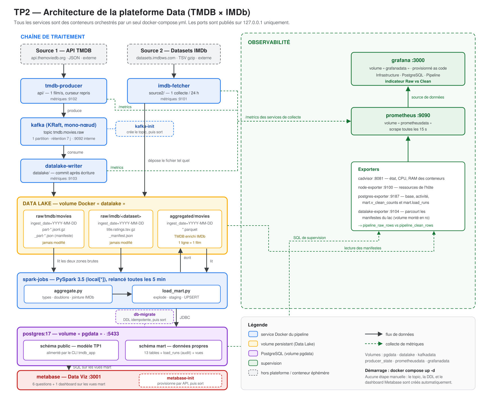

# Choix techniques et fonctionnement de la plateforme

Ce document explique **comment le projet est organisé, comment il fonctionne, et pourquoi
chaque brique a été retenue plutôt qu'une autre**. Le mode d'emploi (démarrage, URLs,
dépannage) est dans le [readme](../readme.md).

---

## 1. Vue d'ensemble



La plateforme transforme deux sources de données cinéma en un entrepôt exploitable et
supervisé. Le sujet métier du TP1 est conservé, et sa modélisation sert de cible aux
données propres.

```
API TMDB ──► tmdb-producer ──► Kafka ──► datalake-writer ──┐
                                                           ├─► Data Lake ─► PySpark ─► PostgreSQL ─► Metabase
Datasets IMDb ──► imdb-fetcher ────────────────────────────┘
                                          Prometheus ──► Grafana
```

Seize services, tous décrits dans un unique `docker-compose.yml`, dont quatre éphémères
(`kafka-init`, `db-migrate`, `metabase-init`, et les jobs Spark relancés en boucle).

## 2. Organisation du dépôt

```
.
├── docker-compose.yml       orchestration de la totalité de la plateforme
├── readme.md                déploiement et utilisation
├── api/                     source 1 : producer TMDB vers Kafka
├── kafka/                   création du topic
├── datalake/                consumer Kafka vers la zone raw + doc du Data Lake
├── source2/                 source 2 : collecte des datasets IMDb + sa doc
├── spark/                   jobs PySpark (agrégation, chargement) et ordonnanceur
├── db/
│   ├── init/                schéma du TP1, joué à la création du volume
│   └── migrations/          schéma mart et vues, rejoués à chaque démarrage
├── dataviz/                 Metabase : questions et provisionnement par API
├── monitoring/              Prometheus, Grafana, exporter du Data Lake
├── fixtures/                mini Data Lake pour exécuter les jobs sans réseau
├── docs/                    schéma d'architecture et ce document
├── tmdb_app/ et main.py     application interactive du TP1, inchangée
└── images/                  MCD et MLD du TP1
```

L'arborescence recommandée par le sujet est respectée à un détail près : le dossier
`postgres/` s'appelle ici **`db/`**, nom déjà utilisé par le TP1 et conservé pour ne pas
casser l'historique ni les chemins existants.

## 3. Les deux sources et leur lien métier

| | Source 1 | Source 2 |
|---|---|---|
| Origine | API REST [TMDB](https://www.themoviedb.org/) | [Datasets publics IMDb](https://developer.imdb.com/non-commercial-datasets/) |
| Format | JSON semi-structuré | TSV compressé gzip |
| Collecte | interrogation continue, 1 film/s | téléchargement complet, 1 fois par jour |
| Apporte | catalogue, métadonnées, casting, note TMDB | note moyenne et nombre de votes IMDb |

**Clé de rapprochement : `movies.imdb_id` = `title.ratings.tconst`** (`tt0111161`).

L'intérêt métier n'est pas de compléter des trous, mais de **confronter deux mesures
indépendantes de la même réalité** : deux communautés de votants distinctes notent les mêmes
films. L'écart (`rating_gap`) et le rapport des volumes de votes (`votes_ratio`) deviennent
des indicateurs à part entière : ils révèlent les films clivants, ceux dont la popularité ne
correspond pas à la qualité perçue, ou une audience très différente d'une plateforme à l'autre.

En pratique la couverture est bonne — environ 97 % des films collectés trouvent leur note IMDb —
et le rapprochement fait immédiatement apparaître un biais systématique : sur ce jeu de données,
TMDB note en moyenne 0,3 à 1 point au-dessus d'IMDb selon le genre.

Les deux sources ont des rythmes opposés — un flux continu et un instantané quotidien — ce qui
justifie précisément l'architecture demandée : Kafka absorbe le flux, le Data Lake réconcilie
les deux temporalités, Spark les rapproche.

## 4. Le parcours d'une donnée

| Étape | Service | Ce qui se passe |
|---|---|---|
| Collecter | `tmdb-producer` (`api/`) | Parcourt les listes TMDB, récupère chaque fiche complète, publie le JSON **intact** dans Kafka |
| Transporter | `kafka` | Topic `tmdb.movies.raw`, clé = identifiant du film, rétention 7 jours |
| Stocker | `datalake-writer` (`datalake/`) | Écrit les messages en JSON Lines gzip dans `raw/tmdb`, avec un manifeste |
| Collecter (2) | `imdb-fetcher` (`source2/`) | Dépose le TSV IMDb tel quel dans `raw/imdb` |
| Agréger et transformer | `aggregate.py` (`spark/`) | Nettoie, dédoublonne, rapproche les deux sources, écrit `aggregated/` en Parquet |
| Charger | `load_mart.py` (`spark/`) | Éclate l'instantané en 13 tables et les charge par UPSERT dans le schéma `mart` |
| Visualiser | `metabase` | 6 questions SQL sur les vues du mart, réunies dans un dashboard |
| Superviser | `prometheus`, `grafana` | Métriques de tous les services, dont l'indicateur Raw vs Clean |

## 5. Contrats d'interface

Ce sont les points de contact entre les briques : les fixer permet de faire évoluer chaque
service indépendamment.

### Message Kafka

```json
{ "source": "tmdb", "endpoint": "/movie/278", "movie_id": 278,
  "fetched_at": "2026-09-25T10:12:03+00:00", "schema_version": 1,
  "payload": { "…JSON TMDB intact…" } }
```

La clé du message est l'identifiant du film : tous les états successifs d'un même film
atterrissent donc dans la même partition, et resteraient ordonnés si le topic en comptait
plusieurs.

### Data Lake

```
raw/tmdb/movies/ingest_date=YYYY-MM-DD/part-HHMMSS-xxxxxxxx.jsonl.gz
                                       _part-HHMMSS-xxxxxxxx.json    ← manifeste
raw/imdb/<dataset>/ingest_date=YYYY-MM-DD/<dataset>.tsv.gz
                                          _manifest.json
aggregated/movies/ingest_date=YYYY-MM-DD/*.parquet
```

Conventions détaillées dans [datalake/README.md](../datalake/README.md) : zone raw jamais
modifiée, partitionnement par date d'ingestion, écriture atomique, fichiers techniques
préfixés par `_` ou `.` (ignorés par Spark), un manifeste par fichier.

### Base de données

- schéma **`public`** : le modèle du TP1, alimenté par l'application interactive ;
- schéma **`mart`** : les données propres du pipeline — 13 tables reprenant les mêmes
  entités, clés et cardinalités que le TP1, plus les colonnes IMDb, plus `load_runs`
  (audit des exécutions) et sept vues d'exploitation.

### Métriques

Préfixe commun `pipeline_*` pour tout ce qui doit être comparable d'un service à l'autre :
`pipeline_raw_rows`, `pipeline_clean_rows`, `pipeline_errors_total{job}`,
`pipeline_last_success_timestamp_seconds{job}`. Chaque service expose `/metrics` sur son
port 8000 interne.

## 6. Choix techniques

### Vue d'ensemble

| Besoin | Retenu | Écarté | Raison |
|---|---|---|---|
| Data Lake | volume Docker | MinIO / S3 | Quelques centaines de Mo sur un seul hôte ; Spark lit un dossier local nativement, sans connecteur `s3a` ni jars supplémentaires. Un service de moins à démarrer et sécuriser |
| Broker | Kafka en mode KRaft | Kafka + ZooKeeper | Mode officiel depuis Kafka 3.3, un conteneur au lieu de deux |
| Format des messages | JSON + schéma figé dans le code | Avro + Schema Registry | Un service et une chaîne de compatibilité en plus, pour un seul producteur et un seul consommateur |
| Format de la zone raw | JSON Lines gzip | Parquet | Aplatir le JSON serait déjà une transformation : la zone raw doit rester fidèle à la source |
| Format de la zone agrégée | Parquet | JSON | Colonnaire, typé, compressé : c'est l'entrée d'un traitement analytique |
| Chargement en base | table de transit + UPSERT SQL | `write.jdbc(mode="overwrite")` | L'overwrite supprime et recrée la table, emportant clés, index et contraintes |
| Métriques des jobs Spark | table `load_runs` relue par postgres-exporter | Pushgateway | Un job batch n'est jamais là quand Prometheus scrute ; la table sert en prime d'audit interrogeable en SQL |
| Ordonnancement | boucle shell | Airflow | Trois services, une base de métadonnées et un scheduler pour un enchaînement linéaire de deux tâches |
| Data Viz | Metabase | Superset | Un conteneur contre plusieurs (Redis, Celery, init) ; connexion à PostgreSQL immédiate |
| Configuration Metabase | base PostgreSQL | H2 dans le conteneur | Le H2 par défaut disparaît à la moindre recréation du conteneur |
| Dashboards | fichiers versionnés (Grafana) et API (Metabase) | configuration à la souris | Le dépôt reste la référence et la plateforme se reconstruit à l'identique |

### Points qui méritent un développement

**Le producer ne valide pas les données.** Les modèles Pydantic du TP1 sont configurés en
`extra="ignore"` : ils suppriment les champs qu'ils ne connaissent pas. Les réutiliser dans le
producer aurait amputé la donnée brute — le payload réel contient par exemple `origin_country`,
absent du modèle du TP1. Le producer publie donc le JSON tel quel, et c'est Spark qui typera.

**Les offsets Kafka sont validés à la main.** Le consumer désactive `enable.auto.commit` et ne
valide un offset qu'**après** le renommage du fichier et l'écriture de son manifeste. Un arrêt
brutal fait donc au pire relire des messages déjà écrits — des doublons, que le job
d'agrégation élimine de toute façon — au lieu de perdre définitivement des messages.

**Seule la dernière partition IMDb est lue.** IMDb republie l'intégralité de ses datasets
chaque jour. Lire toutes les partitions multiplierait chaque titre par le nombre de journées
collectées, avec des jointures dupliquées à la clé. Le job ne lit donc que `max(ingest_date)`.

**La zone agrégée contient des instantanés complets.** Chaque exécution écrit l'état complet
connu dans la partition du jour, remplacée si le job est relancé
(`partitionOverwriteMode=dynamic`), tandis que les journées précédentes restent intactes.
C'est ce qui rend le pipeline rejouable à volonté sans effet de bord.

**Les migrations sont rejouées à chaque démarrage.** Les scripts de `db/init` ne sont exécutés
par l'image PostgreSQL que sur un volume vierge — or le volume existait déjà depuis le TP1.
Le service `db-migrate` applique donc `db/migrations/` à chaque `up`, avec des ordres
idempotents. Les tables de transit, elles, sont recréées à chaque passage : elles ne
contiennent rien de durable, et leur structure suit ainsi automatiquement celle des tables
cibles.

**Les deux jobs ne peuvent pas tourner en parallèle.** Ils partagent un état global : la
partition Parquet du jour, réécrite par l'agrégation et lue par le chargement, et les tables
de transit, vidées puis remplies à chaque chargement. Deux exécutions simultanées se
détruisent mutuellement — fichiers disparaissant en pleine lecture, clés étrangères violées.
Le cas n'a rien de théorique : il suffit de lancer un job à la main pendant que
l'ordonnanceur lance le sien, ce que le README propose justement de faire. Chaque job prend
donc un verrou consultatif PostgreSQL, unique pour tout le pipeline, et s'efface proprement
(statut `skipped`) s'il ne l'obtient pas. Le verrou étant tenu par la connexion, il est
libéré même si le processus est tué.

**Le profil de données est réglable.** `title.basics` pèse 228 Mo pour n'apporter que
l'année, la durée et les genres IMDb. Le profil par défaut ne collecte que `title.ratings`
(9 Mo), qui porte l'enrichissement métier réel. Le job d'agrégation détecte l'absence du
dataset et poursuit sans lui, au lieu d'échouer.

## 7. Observabilité et indicateur Raw vs Clean

Le suivi se lit à **deux niveaux complémentaires** :

1. **Le volume vivant du lac** — `datalake-exporter` parcourt les manifestes toutes les
   30 secondes et publie ce que contient réellement le Data Lake. Un service dédié plutôt
   que des compteurs dans chaque collecteur : un compteur de processus repart de zéro à
   chaque redémarrage et ne décrit que ce que *ce* processus a écrit.
2. **Le bilan par exécution** — chaque job Spark écrit une ligne dans `mart.load_runs`
   (lignes brutes lues, films distincts, lignes propres écrites, rejets, rapprochements,
   durée, statut), que postgres-exporter transforme en métriques.

Le dashboard **Pipeline Data (Raw vs Clean)** superpose trois courbes :

```
messages bruts dans le lac   ─┐
                              ├─ l'écart mesure les doublons de collecte
films distincts après dédoublonnage ─┐
                                     ├─ ces deux-là doivent se rejoindre :
films propres dans PostgreSQL ───────┘   tout ce qui est collecté est chargé
```

Un écart durable entre les deux dernières courbes signale une perte entre le lac et la base ;
un écart entre les deux premières est normal, puisque le producer reboucle sur les listes TMDB
et collecte plusieurs fois le même film.

## 8. Propriétés garanties

| Propriété | Comment elle est obtenue |
|---|---|
| Démarrage reproductible | Topic, schéma de base et dashboard créés automatiquement ; `depends_on` avec conditions de santé |
| Rejouabilité | Création de topic `--if-not-exists`, DDL idempotente, chargement par UPSERT, partitions réécrites sélectivement |
| Aucune perte de message | Validation des offsets après écriture, producer idempotent avec `acks=all` |
| Reprise après arrêt | Curseur du producer persisté, offsets Kafka conservés, lot en cours vidé à l'arrêt |
| Tolérance au démarrage à froid | Les jobs Spark sortent proprement sur un lac vide, l'agrégation fonctionne sans données IMDb |
| Pas d'exécution concurrente | Verrou consultatif PostgreSQL commun aux deux jobs : un job lancé à la main pendant un cycle automatique s'efface au lieu de corrompre le chargement |
| Traçabilité | Manifeste par fichier (empreinte, offsets, lignes), `source_fetched_at` et `ingest_date` sur chaque ligne du mart, table `load_runs` |

## 9. Limites assumées

- **Data Lake mono-hôte** : pas d'accès distant ni de réplication. La même arborescence se
  transposerait telle quelle dans un bucket S3.
- **Kafka mono-nœud** : aucune tolérance de panne du broker. Le Data Lake reste la source de
  vérité, le topic n'est qu'un tampon de sept jours.
- **Kafka n'est pas instrumenté en JMX** : il faudrait un agent Java et sa configuration. Sa
  santé est couverte par cAdvisor, son healthcheck et le retard du consumer.
- **Spark en mode local** : suffisant au volume traité, mais sans répartition sur un cluster.
- **Pas d'alerting** : Prometheus collecte et Grafana affiche, aucune règle d'alerte n'est
  définie.
- **Secrets en clair dans `.env`** : acceptable en contexte pédagogique, à remplacer par un
  gestionnaire de secrets en production.
- **Aucune purge automatique du lac** : la zone raw croît indéfiniment.

## 10. Conformité au sujet

| Attendu | Où |
|---|---|
| Schéma d'architecture avec services et volumes | `docs/architecture.png` |
| Description des choix techniques | ce document |
| Description des deux sources | §3 ci-dessus, `source2/README.md` |
| README de déploiement | `readme.md` |
| Collecte API + Kafka | `api/tmdb_producer.py`, `kafka/create-topics.sh` |
| Collecte source 2 | `source2/imdb_fetcher.py` |
| Agrégation | `spark/aggregate.py` |
| Data Lake | volume `datalake`, `datalake/README.md` |
| Traitement PySpark | `spark/aggregate.py`, `spark/schemas.py` |
| Chargement PostgreSQL | `spark/load_mart.py`, `db/migrations/02_mart.sql` |
| Dashboard Data Viz | `dataviz/questions.py` (dashboard « Pipeline TMDB × IMDb ») |
| Dashboard Grafana | `monitoring/grafana/dashboards/` |
| Métriques infrastructure | cAdvisor, node-exporter, dashboard Infrastructure |
| Métriques PostgreSQL | postgres-exporter, dashboard PostgreSQL |
| Indicateur Raw vs Clean | dashboard Pipeline, `mart.v_raw_vs_clean`, `monitoring/datalake_exporter.py` |
| docker-compose.yml | à la racine, 16 services |
| Dockerfiles et configurations | `api/`, `datalake/`, `source2/`, `spark/`, `dataviz/`, `monitoring/` |
| Volumes et persistance | `pgdata`, `datalake`, `kafkadata`, `producer_state`, `prometheusdata`, `grafanadata` |
