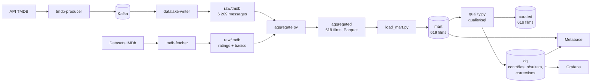
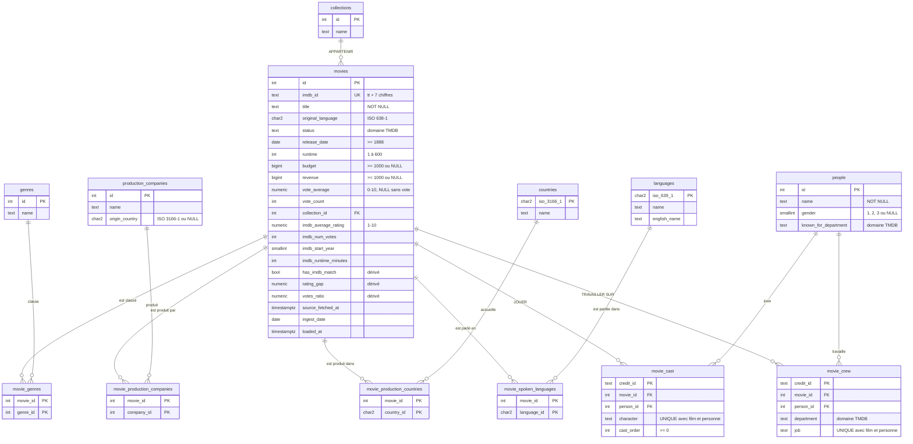

# Cartographie mise à jour (TP3)

La cartographie du TP1 ([sujet1.md](../sujet1.md), §2 à §5) décrivait **une** source, lue par une
application interactive et rangée dans le schéma `public`. Le TP2 a ajouté une seconde source,
un pipeline et le schéma `mart`. Ce document remet la cartographie à jour et la **confronte à la
base réelle** : chaque affirmation ci-dessous a été vérifiée par requête
([`sql/rapports/cartographie.sql`](sql/rapports/cartographie.sql), sortie dans
[`resultats/cartographie.txt`](resultats/cartographie.txt)).

Chiffres de l'audit de référence du 28/09/2026 (619 films).

## 1. Sources

| | Source 1 — TMDB | Source 2 — IMDb |
|---|---|---|
| Organisation | Communauté TMDB | IMDb (Amazon) |
| URL | [api.themoviedb.org](https://developer.themoviedb.org/docs/getting-started) | [datasets.imdbws.com](https://developer.imdb.com/non-commercial-datasets/) |
| Format | JSON (une fiche par film, crédits inclus) | TSV compressé gzip, valeur absente = `\N` |
| Nature | semi-structurée (objets et listes imbriqués) | structurée (tabulaire) |
| Collecte | `/movie/{id}?append_to_response=credits`, en continu, via Kafka | téléchargement complet quotidien |
| Périmètre audité | listes `popular`, `top_rated`, `now_playing`, `upcoming` (10 pages) | `title.ratings` (1 714 855 lignes, 8,7 Mo) et `title.basics` (12 819 789 lignes, 228 Mo) |
| Volume mesuré | 6 209 messages bruts dans le lac, 619 films distincts | 555 films rapprochés d'une note, 579 d'une fiche `title.basics` |
| Apporte | catalogue, métadonnées, crédits, note TMDB | seconde note et volume de votes, année, durée, genres |

**Clé de rapprochement** : `movies.imdb_id` = `tconst`. 602 films sur 619 ont un identifiant
IMDb, 555 trouvent leur note (89,7 %) : les 47 autres sont des films pas encore sortis, absents
de `title.ratings` qui ne liste que les titres ayant reçu des votes.

Pour l'audit, la collecte a été élargie aux films à l'affiche et à venir (`now_playing`,
`upcoming`) et `title.basics` a été téléchargé une fois : le jeu du TP2 (films populaires et
mieux notés, 184 films) était trop « propre » pour exercer la matrice, et `title.basics` permet
les contrôles et l'imputation entre sources. Aucun fichier suivi n'a été modifié pour cela
(variables d'environnement passées à la commande).

## 2. Cheminement de la donnée

| Couche | Où | Ce qui s'y passe | Règles de qualité appliquées |
|---|---|---|---|
| raw | Data Lake | donnée brute, jamais modifiée | aucune (principe du lac) |
| aggregated | Data Lake, Parquet | dédoublonnage, typage, rapprochement IMDb | rejet sans id ni titre, `""` → NULL (textes du film), `0` → NULL (budget, recette, durée) |
| mart | PostgreSQL | éclatement en 13 tables, UPSERT | clés primaires et étrangères, NOT NULL |
| **curated** | PostgreSQL (TP3) | nettoyage journalisé | les 49 contrôles de la matrice, 94 contraintes cibles |
| **dq** | PostgreSQL (TP3) | traçabilité du contrôle qualité | — |

Le contrôle qualité est la **troisième étape du pipeline** : l'ordonnanceur Spark l'enchaîne
après chaque chargement (job `quality` dans `mart.load_runs`).

## 3. Schémas et tables de la base

| Schéma | Rôle | Alimenté par |
|---|---|---|
| `public` | modèle du TP1 | application interactive `main.py` |
| `mart` | données propres du pipeline (TP2) | `spark/load_mart.py`, toutes les 5 minutes |
| `curated` | données nettoyées conformes au schéma cible (TP3) | `quality/sql/03_nettoyage.sql`, recréé à chaque exécution |
| `dq` | matrice, résultats et journal du contrôle qualité (TP3) | `quality/sql/00` à `05` |

Volumes vérifiés, table par table :

| Table | Type (MCD) | public (TP1) | mart (TP2) | curated (TP3) |
|---|---|---:|---:|---:|
| `genres` | référentiel | 11 | 19 | 19 |
| `collections` | référentiel | 4 | 132 | 131 |
| `production_companies` | référentiel | 57 | 1 437 | 1 437 |
| `countries` | référentiel | 8 | 63 | 63 |
| `languages` | référentiel | 5 | 61 | 61 |
| `people` | entité | 2 409 | 62 270 | 62 267 |
| `movies` | entité | 20 | 619 | 619 |
| `movie_genres` | liaison | 51 | 1 567 | 1 566 |
| `movie_production_companies` | liaison | 60 | 2 111 | 2 111 |
| `movie_production_countries` | liaison | 29 | 909 | 909 |
| `movie_spoken_languages` | liaison | 22 | 891 | 890 |
| `movie_cast` | relation porteuse | 652 | 23 061 | 23 054 |
| `movie_crew` | relation porteuse | 1 923 | 60 340 | 60 336 |

Aucun film n'est supprimé par le nettoyage ; les écarts portent sur des liaisons obsolètes, des
doublons et des orphelins (voir le [rapport d'audit](rapport-audit.md)).

## 4. Dictionnaire de données : mises à jour

Le dictionnaire du TP1 reste valable pour les colonnes qu'il décrit. Voici ce qui a changé.

### 4.1 Colonnes ajoutées à `movies` au TP2

| Champ | Description | Type | Source | Exemple |
|---|---|---|---|---|
| `imdb_average_rating` | Note moyenne IMDb, sur 10 | `NUMERIC(3,1)` | `title.ratings.averageRating` | `7.4` |
| `imdb_num_votes` | Nombre de votes IMDb | `INTEGER` | `title.ratings.numVotes` | `18422` |
| `imdb_start_year` | Année de sortie selon IMDb | `SMALLINT` | `title.basics.startYear` | `2026` |
| `imdb_runtime_minutes` | Durée selon IMDb, en minutes | `INTEGER` | `title.basics.runtimeMinutes` | `150` |
| `imdb_genres` | Genres IMDb (3 au plus) | `TEXT[]` | `title.basics.genres` | `{Action,Adventure,Sci-Fi}` |
| `has_imdb_match` | Une note IMDb a été trouvée | `BOOLEAN` NOT NULL | dérivé | `true` |
| `rating_gap` | Note TMDB moins note IMDb | `NUMERIC(4,2)` | dérivé | `0.46` |
| `votes_ratio` | Votes TMDB / votes IMDb | `NUMERIC(10,4)` | dérivé | `0.1556` |
| `source_fetched_at` | Date de collecte du message TMDB | `TIMESTAMPTZ` | enveloppe Kafka | `2026-09-28 08:03:12+00` |
| `ingest_date` | Instantané du pipeline qui a produit la ligne | `DATE` | partition `aggregated` | `2026-09-28` |
| `loaded_at` | Dernière écriture en base | `TIMESTAMPTZ` NOT NULL | chargement | `2026-09-28 08:20:39+00` |

`fetched_at` (TP1, date d'import par l'application) n'existe pas dans le mart : il est remplacé
par la paire `source_fetched_at` (collecte) / `loaded_at` (chargement), qui distingue l'âge de la
donnée de celui de son chargement.

### 4.2 Sémantique précisée par l'audit

| Champ | TP1 | Constaté dans le mart | Règle du schéma cible |
|---|---|---|---|
| `budget`, `revenue` | « `0` = inconnu » | `0` déjà converti en NULL au TP2 ; une valeur symbolique (7 USD) subsiste | NULL si inconnu, ≥ 1 000 USD sinon |
| `vote_average` | « note moyenne, sur 10 » | **74 films sans aucun vote notés 0** | NULL tant qu'aucun vote (`vote_count > 0 OR vote_average IS NULL`) |
| `people.gender` | « `0` non renseigné, 1, 2, 3 » | 44 % des personnes à `0` | domaine `{1, 2, 3}`, NULL si non renseigné |
| `production_companies.origin_country` | « `""` converti en NULL » | **127 sociétés à `''`** | code ISO 3166-1 alpha-2 ou NULL |
| `movie_cast.character`, textes | — | 736 personnages `''`, 11 noms de langue `''`, un nom avec espace final | texte normalisé : ni vide ni espace parasite |
| `rating_gap` | — | 10 écarts d'un centième avec les notes affichées | exactement `round(vote_average - imdb_average_rating, 2)` |
| `imdb_id` | « identifiant IMDb » | format jamais vérifié (aucune anomalie trouvée) | `^tt[0-9]{7,}$`, unique |

### 4.3 Domaines de valeurs observés

| Champ | Valeurs observées |
|---|---|
| `status` | `Released` (586), `Post Production` (26), `In Production` (6), `Planned` (1) |
| `known_for_department` | les 12 départements TMDB + `Creator` (15 personnes) |
| `original_language` | 619 codes, tous présents dans le référentiel `languages` |
| `release_date` | 1921 à 2026 ; 29 films `Released` datés dans le futur |
| `runtime` | 5 à 275 minutes ; 23 films sans durée |

## 5. Relations vérifiées

Les **13 relations du MLD** existent comme clés étrangères dans les trois schémas `public`,
`mart` et `curated` (section 6 du rapport de cartographie). Le contrôle INT-01 le confirme sur
les données : aucune liaison orpheline.

Deux écarts au MCD apparaissent cependant sur les données, qu'aucune clé ne pouvait empêcher :

- **Cardinalité (1,N) des référentiels** : une saga (*Man with No Name Collection*) et trois
  personnes ne sont plus reliées à aucun film. Elles l'ont été, puis TMDB a modifié la fiche.
- **Liaisons N-N supposées refléter l'état actuel** : l'application du TP1 supprimait puis
  réinsérait les liaisons d'un film ; le chargement du TP2 ne fait qu'ajouter. 12 liaisons
  (7 rôles, 3 postes, 1 genre, 1 langue) ont disparu chez TMDB mais restent dans le mart.

Attributs volontairement non reliés au TP1 : `original_language` est couvert à 100 % par le
référentiel `languages`, `origin_country` à 1 309 / 1 310 (le code `PT` d'une société n'apparaît
comme pays de production d'aucun film collecté). Le choix du TP1 (pas de clé étrangère) est
confirmé : une clé aurait rejeté cette société.

Cardinalités observées par film (profilage, section 9) : 0 à 6 genres (2,5 en moyenne),
0 à 202 rôles, 0 à 947 postes techniques. Trois films n'ont aucun genre, deux aucun casting.

## 6. Écarts entre la cartographie et l'implémentation

| # | Documenté | Constaté | Conséquence | Traitement |
|---|---|---|---|---|
| 1 | `origin_country` : `""` converti en NULL (TP1) | le pipeline stocke `''` en `CHAR(2)` | complétude surestimée, 127 « pays » vides | VAL-09 / VAL-16, corrigé à la source |
| 2 | liaisons = état actuel du film (TP1) | le chargement n'en retire jamais | genres et crédits fantômes | COH-09, corrigé à la source |
| 3 | référentiels en (1,N) (MCD) | orphelins après modification d'une fiche | référentiels gonflés | INT-03 / INT-04, corrigé à la source |
| 4 | `vote_average` : note moyenne | `0` pour « aucun vote » | moyennes par genre faussées jusqu'à 5,5 points | COH-01, corrigé à la source |
| 5 | `gender` : `0` = non renseigné | `0` traité comme une catégorie | répartitions faussées | VAL-13, corrigé à la source |
| 6 | `rating_gap` = TMDB − IMDb | calculé sur la note non arrondie | écarts d'un centième | COH-03, corrigé à la source |
| 7 | `fetched_at` | remplacé par `source_fetched_at` / `loaded_at` | — | dictionnaire mis à jour (§4.1) |
| 8 | codes ISO sur 2 caractères | Spark tronque silencieusement à 2 caractères | un code à 3 lettres serait altéré sans alerte | aucun cas constaté, limite documentée |

## 7. Schéma cible (`curated`)

Mêmes 13 tables, mêmes types et mêmes relations que le mart, auxquels le schéma cible ajoute
les règles de la matrice sous forme de contraintes
([`sql/04_schema_cible.sql`](sql/04_schema_cible.sql)) :

| Contraintes | mart | curated |
|---|---:|---:|
| clés primaires | 13 | 13 |
| clés étrangères | 13 | 13 |
| unicité (`imdb_id`, rôles, postes) | 0 | 3 |
| CHECK (formats, plages, domaines, cohérence, texte normalisé) | 0 | 65 |

## 8. Schéma `dq`

| Objet | Contenu |
|---|---|
| `dq.model_tables` | les 13 tables du modèle et l'expression de leur clé |
| `dq.controls` | la matrice : 49 contrôles, leurs règles, sévérités, seuils, traitements, justifications et requêtes |
| `dq.runs` | une ligne par exécution : volumes, anomalies avant/après, corrections |
| `dq.results` | bilan de chaque contrôle, par exécution et par phase (avant/après), 30 jours d'historique |
| `dq.anomalies` | lignes en anomalie (dernière exécution) |
| `dq.corrections` | journal des corrections : clé, colonne, action, ancienne et nouvelle valeur (dernière exécution) |
| `v_results_last`, `v_dimension_scores`, `v_corrections_summary`, `v_volumes`, `v_kpi_impact`, `v_genre_impact`, `v_history` | vues de synthèse lues par les rapports, Metabase et postgres-exporter |

## 9. Modèle logique (Mermaid)

Le MLD du TP1 ([images/diagram_mld.png](../images/diagram_mld.png)) complété des colonnes du
TP2 et des contraintes du TP3.

